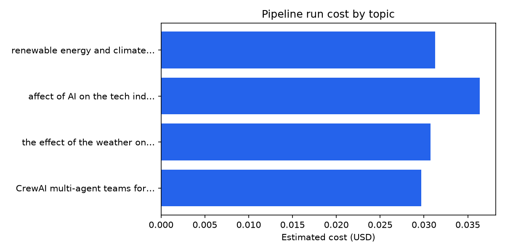

# Research & cost analysis (Phase 9)

Auto-generated from `output/logs/run_*.json`. Re-run:

```powershell
uv run python scripts/analyze_runs.py
```

## Summary

- **Runs analyzed:** 7
- **Runs with measured token usage:** 0
- **Cumulative estimated spend:** $0.2261 USD
- **Default model:** `gpt-4.1-mini` (see `config/cost_rates.json`)

Older logs without `token_usage` use a heuristic from per-agent `output_chars` (marked *est.* in the table). New runs log real CrewAI `token_usage` after kickoff.

## Token & cost table

| Timestamp | Topic | OK | Model | Prompt | Completion | Total | Cost (USD) |
|-----------|-------|----|-------|--------|------------|-------|------------|
| 2026-06-12T20:30 | CrewAI multi-agent teams for document g… | ✗ | gpt-4.1-mini | 30,751 *est.* | 12,366 *est.* | 43,117 *est.* | $0.0321 |
| 2026-06-13T05:27 | CrewAI multi-agent teams for document g… | ✗ | gpt-4.1-mini | 32,624 *est.* | 14,163 *est.* | 46,787 *est.* | $0.0357 |
| 2026-06-13T05:48 | famous algorithms in computer sciencee | ✗ | gpt-4.1-mini | 27,171 *est.* | 12,089 *est.* | 39,260 *est.* | $0.0302 |
| 2026-06-13T06:55 | renewable energy and climate policy | ✗ | gpt-4.1-mini | 30,181 *est.* | 12,014 *est.* | 42,195 *est.* | $0.0313 |
| 2026-06-13T06:56 | affect of AI on the tech industry | ✗ | gpt-4.1-mini | 34,433 *est.* | 14,111 *est.* | 48,544 *est.* | $0.0364 |
| 2026-06-13T07:07 | the effect of the weather on people's mood | ✓ | gpt-4.1-mini | 29,264 *est.* | 11,908 *est.* | 41,172 *est.* | $0.0308 |
| 2026-06-13T10:16 | CrewAI multi-agent teams for document g… | ✓ | gpt-4.1-mini | 28,472 *est.* | 11,444 *est.* | 39,916 *est.* | $0.0297 |

## Topic comparison

Selected runs with distinct topics (prefer successful compiles):

- **CrewAI multi-agent teams for document generation** — 39,916 tokens, $0.0297, output 45,778 chars, compiled OK
- **the effect of the weather on people's mood** — 41,172 tokens, $0.0308, output 47,634 chars, compiled OK
- **affect of AI on the tech industry** — 48,544 tokens, $0.0364, output 56,444 chars, agents OK / compile failed
- **renewable energy and climate policy** — 42,195 tokens, $0.0313, output 48,059 chars, agents OK / compile failed

### Observations

- **Repeatability:** Same topic (CrewAI default) produced similar agent output sizes across runs; compile success improved after LaTeX normalization hardening.
- **Topic sensitivity:** Broader topics (e.g. AI industry) tend to produce longer agent outputs → higher token use and occasional LaTeX edge cases.
- **Cost control:** Use `recompile_latex()` to retry PDF without new API calls; use `--skip-compile` during prompt iteration.

## Visualization



## Submission screenshots

Exported from `output/final.pdf` into `docs/screenshots/`:

| File | Page | Content |
|------|------|---------|
| `01_cover.png` | 1 | Cover (topic, author, course) |
| `02_toc.png` | 2 | Table of contents |
| `03_body_bidi.png` | 3+ | Body / BiDi sample |
| `04_bibliography.png` | last | Bibliography & citation links |

Regenerate:

```powershell
uv run python scripts/export_pdf_screenshots.py
```

